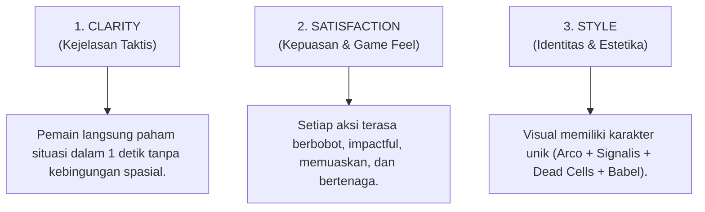
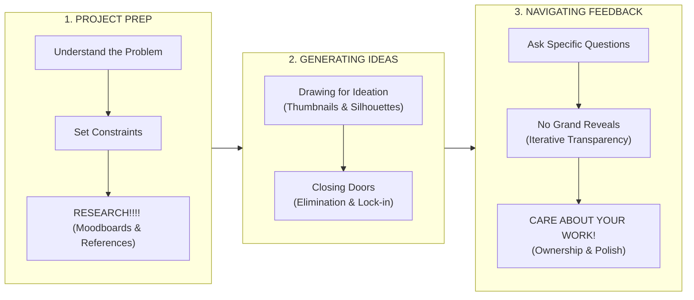

# Visual Art & Concept Art Rules (Pedoman Seni Visual & Seni Konsep)

> **Status:** Active / Master Standard  
> **Ruang Lingkup:** Global Game Art, Concept Art, Isometric Pixel Sprites, Environment, VFX & Card Illustration  
> **Target Proyek:** Pilot Game (Tactical Roguelike Deck-Builder)

---

## 1. Ikhtisar & Filosofi Seni Visual (Overview & Art Philosophy)

Dokumen ini adalah **Single Source of Truth (SSoT)** untuk seluruh arahan seni visual (*visual art direction*), seni konsep (*concept art*), pembuatan aset piksel, efek visual (VFX), dan ilustrasi kartu dalam *Pilot Game*.

Tujuan utama arahan visual adalah menciptakan dunia yang memikat, atmosferik, dan konsisten, namun **selalu mengutamakan kejelasan taktis (tactical readability)** di atas arena isometrik 15×15 ubin.

### Identitas Visual Pilot Game:
*   **Perspektif & Format:** *Isometric Pixel Art* dengan proyeksi tajam dan elegan (referensi: *Arco*).
*   **Tema & Atmosfer:** *Dark Retro-Futuristic / Anime Fantasy* (referensi: *Signalis*) berpadu dengan tema *Medieval Dark Fantasy* yang bertransisi ke *Ancient Mesopotamia / Menara Babel* dengan nuansa *"gelap-gelap ceria"* (referensi: *Dead Cells*).
*   **Palet Utama:** Dominasi nada gelap (*charcoal, cold slate, deep stone*) dengan sentuhan warna kontras **Kuning-Oranye (*Yellow-Orange / Amber / Gold*)** sebagai warna aksen pencahayaan, energi sihir *Grimoire*, proyektil, dan telegraph bahaya.

```
+-------------------------------------------------------------------------+
|                           VISUAL ART PILLARS                            |
|                                                                         |
|   1. CLARITY           2. SATISFACTION           3. STYLE               |
|   (Keterbacaan Taktis)    (Game Feel & Juice)       (Identitas Visual)  |
+-------------------------------------------------------------------------+
                                    |
                                    v
+-------------------------------------------------------------------------+
|                            VISUAL HIERARCHY                             |
|                                                                         |
|   * Value Contrast (3-Tier Depth)                                       |
|   * Shape & Size Contrast (Siluet & Hierarki Musuh)                     |
|   * Detail Placement (Focal Points vs Resting Eyes / 80-20 Rule)        |
+-------------------------------------------------------------------------+
                                    |
                                    v
+-------------------------------------------------------------------------+
|                          CONCEPT ART WORKFLOW                           |
|                                                                         |
|   1. PROJECT PREP       2. GENERATING IDEAS       3. NAVIGATING FEEDBACK|
|   - Understand Problem  - Drawing for Ideation    - Ask Specific Qs     |
|   - Set Constraints     - Closing Doors           - No Grand Reveals    |
|   - Research!!!!                                  - Care About Work!    |
+-------------------------------------------------------------------------+
```

---

## 2. Tiga Pilar Mutlak Seni Visual (Core Art Pillars)

Setiap aset visual—baik itu karakter, musuh, semak (*bush*), ubin arena, kartu, maupun efek visual (VFX)—**WAJIB** memenuhi 3 pilar fundamental berikut:



### 2.1. CLARITY (Kejelasan & Keterbacaan Visual)

Dalam game *tactical roguelike deck-builder*, kejelasan informasi adalah penentu hidup dan matinya pemain. Desain visual tidak boleh mengorbankan keterbacaan mekanik gameplay.

1.  **The 1-Second Readability Rule:**
    *   Hanya dengan melirik layar selama 1 detik, pemain harus dapat membedakan:
        *   Di mana posisi Karakter Pemain.
        *   Di mana musuh berdiri dan apa tipe serangannya (Melee, Ranged, Support).
        *   Apa niat musuh (*Enemy Intent*) yang sedang tertelegraf di atas kepala mereka.
        *   Ubin mana yang aman, ubin mana yang berada dalam zona bahaya/AoE, dan ubin mana yang berupa semak (*stealth bush*).
2.  **Invisible Grid Spasial:**
    *   Meskipun garis *grid* dibuat tidak kasat mata (*invisible grid*) demi estetika natural dunia, setiap elemen lingkungan dan karakter harus dirancang sedemikian rupa sehingga posisi ubin tetap terbaca secara presisi (1 ubin = 1 karakter / lebar semak 1 ubin).
3.  **Transparansi Intensi Musuh (100% Visual Telegraph):**
    *   Ikon *intent* di atas kepala musuh harus memiliki kontras tinggi dan bentuk simbolis yang tidak ambigu (pedang untuk serangan fisik, busur untuk proyektil, lingkaran sihir untuk AoE/buff, perisai untuk bertahan).
4.  **Siluet & Separasi Layer:**
    *   Karakter dan musuh tidak boleh "tenggelam" ke dalam tekstur lantai. Gunakan *outline* halus, *edge highlight*, atau penyesuaian *value* agar unit selalu terpisah tegas dari *ground*.

---

### 2.2. SATISFACTION (Kepuasan, Bobot & Visual Juice)

Visual harus memberikan kenikmatan estetika dan *feedback* yang memuaskan (*juicy*) saat dimainkan.

1.  **Weight & Impact (Bobot Aksi):**
    *   Setiap pukulan, ayunan pedang, tembakan sihir dari *Grimoire*, atau lemparan proyektil harus memiliki bobot (*weight*).
    *   Terapkan prinsip animasi:
        *   **Anticipation (Ancang-ancang):** Karakter/musuh menarik badan/senjata sebelum melepaskan serangan.
        *   **Impact Frame / Freeze Frame (1-2 frame):** Penekanan visual saat serangan mendarat tepat pada target.
        *   **Recoil & Recovery:** Gerakan sentakan mundur setelah mengeluarkan energi besar.
2.  **Visual Juice & Micro-Rewards:**
    *   **Hit Spark & Particles:** Percikan partikel warna kuning-oranye menyala saat terjadi *critical hit* atau benturan serangan.
    *   **Evasion Feedback:** Animasi manuver *dodge* yang lincah dan partikel jejak (*afterimage / dust cloud*) saat karakter berpindah ubin.
    *   **Card Playback FX:** Transisi kartu yang responsif saat di-*drag* ke arena tempur, disertai kilatan magis saat skill di-cast.
    *   **Transient Health Bar:** Bar HP musuh yang muncul dengan animasi halus saat menerima damage, lalu menghilang rapi tanpa mengotori layar.
3.  **Dinamika Suasana ("Gelap-gelap Ceria"):**
    *   Meskipun dunia hancur dan penuh keputusasaan, pencahayaan dan efek visual harus dinamis dan memancarkan energi (pantulan cahaya lentera, pendaran sihir, debu atmosferik yang melayang).

---

### 2.3. STYLE (Gaya & Identitas Visual Unik)

Pilot Game memadukan inspirasi terkurasi untuk menciptakan identitas visual yang khas dan mudah dikenali (*memorable*).

1.  **Fusi Tiga Pilar Inspirasi:**
    *   **Arco:** Struktur *Isometric Pixel Art* bersih, presisi ubin catur, keanggunan siluet karakter minimalis bertopi/berjubah, dan kedalaman medan laga taktis.
    *   **Signalis:** Estetika *Dark Retro-Futuristic / Anime Fantasy*, misteri kelam, atmosfer melankolis, dan ketegasan garis desain.
    *   **Dead Cells:** Atmosfer *"gelap-gelap ceria"*, di mana lingkungan gelap dipadukan dengan aksen partikel neon, pencahayaan dramatis, dan saturasi kontras yang tajam.
2.  **Palet Warna & Aksen Kontras:**
    *   **Latar Belakang & Lingkungan:** Nada dingin dan suram (*Deep Slate Gray, Midnight Blue, Desaturated Stone, Umber*).
    *   **Warna Aksen Inti (Hero Color):** **Kuning-Oranye (*Yellow-Orange / Radiant Gold / Amber*)**. Digunakan secara konsisten untuk:
        *   Energi sihir yang terpancar dari Buku Sakti (*Grimoire*).
        *   Indikator *Enemy Intent* dan bahaya AoE.
        *   Objek interaktif, artefak, dan pendaran cahaya lentera perpustakaan.
3.  **Evolusi Arsitektur Menara Babel:**
    *   **Lantai Awal (Lower Floors):** *Medieval Dark Fantasy Library* yang tertata rapi, dipenuhi rak buku raksasa, gulungan kertas, meja arsip, dan lilin.
    *   **Lantai Atas (Ascension Floors):** Transisi arsitektur menuju *Ancient Mesopotamia / Ziggurat*, dinding batu berukir huruf paku (*cuneiform*), distorsi geometris, batu melayang, dan keanehan distorsi sihir kosmis.

---

## 3. Visual Hierarchy (Hierarki Visual Medan Tempur)

Hierarki visual mengatur urutan elemen yang dilihat oleh mata pemain di medan laga 15×15 ubin.

```
+-------------------------------------------------------------------------+
|                  TINGKAT KEPENTINGAN VISUAL MEDAN LAGA                  |
|                                                                         |
|  [PRIORITAS 1 - TERTINGGI] : Enemy Intent, AoE Danger Zone, Active FX   |
|  [PRIORITAS 2 - TINGGI]    : Main Character (Grimoire), Enemy Units     |
|  [PRIORITAS 3 - MENENGAH]  : Interactive Objects, Stealth Bush, Loot   |
|  [PRIORITAS 4 - TERENDAH]  : Ground Tiles (Floor), Static Environment   |
+-------------------------------------------------------------------------+
```

---

### 3.1. VALUE CONTRAST (Kontras Nilai Gelap-Terang)

Kontras nilai (*value contrast*) adalah alat utama untuk memastikan kedalaman dan pemisahan elemen visual tanpa bergantung penuh pada warna.

1.  **Sistem 3-Tingkat Nilai (3-Tier Value System):**
    *   **Tier 1: Background & Ground (Value Rendah / Gelap 20% - 40%):** Ubin lantai arena harus bernilai gelap dan tenang agar berfungsi sebagai panggung netral.
    *   **Tier 2: Karakter & Musuh (Value Menengah-Tinggi 50% - 75%):** Tubuh, armor, dan siluet unit harus memiliki rentang *value* yang lebih terang atau lebih kontras dibandingkan ubin tempat mereka berpijak.
    *   **Tier 3: FX Kritis & UI Telegraph (Value Tertinggi / Terang 85% - 100%):** Ikon *intent*, proyektil sihir, ubin bahaya AoE, dan highlight *Grimoire* menggunakan nilai paling terang dan berpendar (*bloom/glow*).
2.  **Uji Nilai Monokrom (*The Grayscale / Squint Test*):**
    *   Setiap desain karakter, ubin, dan mockup *battlefield* **WAJIB diuji dalam mode hitam-putih (grayscale)**.
    *   Jika karakter menyatu/hilang ke dalam lantai saat dilihat dalam mode hitam-putih, *value* harus segera diperbaiki sebelum masuk ke tahap pewarnaan akhir.

---

### 3.2. SHAPE & SIZE CONTRAST (Kontras Bentuk & Ukuran)

Bentuk dan ukuran mengomunikasikan fungsi, kelas, dan tingkat bahaya setiap unit secara instan.

1.  **Hierarki Musuh Berdasarkan Ukuran & Siluet:**
    *   **Minion (Kroco):**
        *   *Ukuran:* Paling kecil di antara unit lain (menempati sebagian ubin).
        *   *Bentuk:* Siluet sederhana, sudut membulat/kurang agresif, minim ornamen.
        *   *Karakteristik:* Terlihat rapuh, jumlah banyak, tidak mengintimidasi secara individual.
    *   **Regular (Menengah):**
        *   *Ukuran:* Standar proporsional manusia/makhluk tempur.
        *   *Bentuk:* Siluet tegas, proporsi seimbang, senjata terlihat jelas.
    *   **Elite & Boss (Tertinggi):**
        *   *Ukuran:* Lebih besar, mendominasi ubin secara visual.
        *   *Bentuk:* Siluet agresif, sudut tajam, asimetris, ornamen megah (tanduk, jubah koyak, mahkota kuno, aura sihir).
        *   *Karakteristik:* Langsung memancarkan aura ancaman fatal saat pertama kali muncul di arena.
2.  **Diferensiasi Bentuk Kelas Musuh (*Classless Equipment Visuals*):**
    *   **Melee:** Siluet kokoh berblok, bahu lebar, perisai tebal bersudut kotak, pedang/gada berbobot.
    *   **Ranged:** Siluet ramping dan fleksibel, busur melengkung atau senjata tembak dengan garis diagonal dinamis.
    *   **Support / AoE:** Siluet menjuntai vertikal (jubah panjang, tudung misterius, tongkat sihir, atau relik melayang).
3.  **Keunikan Karakter Utama:**
    *   Karakter pemain harus memiliki elemen siluet ikonik yang membedakannya dari semua musuh: **Buku Sakti (*Grimoire*)** yang digenggam atau melayang di sisi karakter, memancarkan pendaran cahaya oranye.

---

### 3.3. DETAIL PLACEMENT (Penempatan Detail & Area Istirahat Mata)

Detail yang terlalu banyak di semua tempat akan merusak estetika dan membuat mata pemain cepat lelah (*visual fatigue*).

1.  **Aturan 80/20 (*Area of Rest vs Focal Points*):**
    *   **80% Area Tenang (*Resting Areas*):** Ubin lantai, dinding batas arena, dan bagian tubuh netral unit dibuat dengan tekstur bersih, gradasi halus, dan minim noise.
    *   **20% Area Fokus (*Focal Points*):** Konsentrasi detail piksel tinggi hanya ditempatkan pada titik-titik krusial yang perlu diperhatikan pemain.
2.  **Larangan *Pixel Clutter* / *Over-dithering*:**
    *   Dilarang menggunakan teknik *dithering* berlebihan pada ubin lantai yang menciptakan kesan kotor/berisik.
    *   Ubin semak (*bush*) dibuat dengan kluster piksel daun yang jelas dan terstruktur, bukan bintik-bintik acak.
3.  **Titik Fokus Utama (*Key Focal Areas*):**
    *   **Focal Area 1:** Kepala dan gestur mata/wajah karakter & musuh.
    *   **Focal Area 2:** Senjata aktif yang digenggam dan Buku Sakti (*Grimoire*).
    *   **Focal Area 3:** Indikator *Intent* dan area telegraf serangan di lantai.

---

## 4. Concept Art Workflow & Rules (Alur & Pedoman Seni Konsep)

Concept Art bukan sekadar membuat ilustrasi indah, melainkan **proses pemecahan masalah visual (visual problem-solving)** untuk mendukung mekanik gameplay dan narasi.



---

### 4.1. FASE 1: PROJECT PREP (Persiapan Proyek)

Sebelum menyentuh kanvas digital atau menggambar garis pertama, Concept Artist **WAJIB** melalui 3 langkah persiapan:

1.  **UNDERSTAND THE PROBLEM (Pahami Masalahnya):**
    *   Apa fungsi gameplay dari aset ini? (Contoh: *"Kita butuh musuh Melee tipe Minion yang bergerak lambat tetapi punya serangan single-target mematikan"*).
    *   Apa cerita atau pesan narasi yang harus disampaikan? (Contoh: *"Ini adalah pustakawan kuno Babel yang terdistorsi oleh sihir gelap arsip"*).
    *   Bagaimana unit ini berinteraksi di arena 15×15? (Bagaimana bentuknya saat berdiri di ubin semak? Bagaimana ikon intent diletakkan di atas kepalanya?).
2.  **SET CONSTRAINTS (Tetapkan Batasan di Awal):**
    *   **Batasan Teknis:** Resolusi piksel sprite isometrik (rasio 2:1), batasan dimensi ubin (1 tile per karakter), batas palet warna, dan kompatibilitas engine Unity.
    *   **Batasan Spasial:** Desain tidak boleh terlalu lebar hingga menutupi ubin di samping atau belakangnya secara berlebihan.
    *   **Batasan Gameplay:** Karakter dengan pertahanan tebal harus terlihat ber-armor; karakter yang lincah harus terlihat ringan.
3.  **RESEARCH!!!! (Riset Menyeluruh & Mendalam):**
    *   **DILARANG MENGGAMBAR DARI INGATAN SEMATA!**
    *   Kumpulkan referensi visual nyata dan referensi industri:
        *   Arsitektur Ziggurat, ornamen Mesopotamia, relief batu Asiria/Babilonia.
        *   Manuskrip kuno abad pertengahan, buku mantra, relik gereja kuno.
        *   Proporsi dan teknik rendering pixel art dari game referensi (*Arco, Signalis, Dead Cells, Hyper Light Drifter*).
        *   Material dunia nyata (tekstur kain jubah usang, besi berkarat, pendar lilin, kilau emas kuno).
    *   Susun dan kurasi ke dalam *Moodboard* sebelum memulai proses sketsa.

---

### 4.2. FASE 2: GENERATING IDEAS (Eksplorasi Ide)

Fase ini berfokus pada kuantitas dan eksplorasi bentuk, bukan kehalusan rendering.

1.  **DRAWING FOR IDEATION (Menggambar untuk Menemukan Ide, Bukan Memoles):**
    *   **Thumbnailing & Silhouettes:** Buat 10-20 variasi siluet hitam-putih dengan cepat (kasar, berani, dan ekspresif).
    *   **Shape Exploration:** Eksplorasi bentuk geometris dasar (segitiga untuk agresif/cepat, kotak untuk kokoh/lambat, lingkaran untuk fleksibel/mistis).
    *   **Jangan Langsung Polishing:** Dilarang memberi warna detail, bayangan halus, atau tekstur sebelum siluet dan proporsinya disetujui. Gambar adalah alat berpikir (*thinking tool*).
2.  **CLOSING DOORS (Menutup Pintu / Mengeliminasi Opsi):**
    *   Setelah membuat banyak opsi, lakukan seleksi ketat.
    *   Eliminasi opsi yang tidak sesuai dengan batasan teknis atau tidak selaras dengan tema Menara Babel.
    *   Persempit dari 15 opsi menjadi **3 arah terbaik**, lalu diskusikan untuk mengunci **1 arah definitif** (*locking in the direction*).
    *   Menutup pintu berarti membuat keputusan berani agar tim dapat melangkah maju tanpa keraguan.

---

### 4.3. FASE 3: NAVIGATING FEEDBACK (Navigasi & Komunikasi Umpan Balik)

Kolaborasi antara Concept Artist, Game Designer, dan Technical Lead membutuhkan komunikasi yang efektif dan terbuka.

1.  **ASK SPECIFIC QUESTIONS (Ajukan Pertanyaan Spesifik):**
    *   **JANGAN PERNAH BERTANYA:** *"Gimana menurutmu?"* atau *"Keren nggak?"* (Pertanyaan ini memicu umpan balik subjektif yang tidak terarah).
    *   **AJUKAN PERTANYAAN FUNGSIONAL & TERARAH:**
        *   *"Apakah siluet musuh Ranged ini sudah cukup jelas membedakannya dari musuh Melee?"*
        *   *"Apakah warna Grimoire ini cukup kontras saat diletakkan di atas ubin lantai gelap perpustakaan?"*
        *   *"Apakah proporsi armor pada Elite ini sudah cukup mencerminkan bahwa dia memiliki buff defense tinggi?"*
2.  **NO GRAND REVEALS (Hindari Kejutan Hasil Akhir):**
    *   **Jangan bekerja dalam isolasi selama berminggu-minggu** lalu tiba-tiba menunjukkan hasil akhir yang sudah dipoles penuh.
    *   Terapkan proses iterasi transparan dan berkala:
        $$\text{Thumbnail / Siluet} \longrightarrow \text{Uji Value Grayscale} \longrightarrow \text{Color Pass / Lighting} \longrightarrow \text{In-Game Mockup} \longrightarrow \text{Final Asset}$$
    *   Umpan balik di tahap sketsa murah untuk diperbaiki; umpan balik di tahap sprite selesai sangat mahal dan membuang waktu.
3.  **CARE ABOUT YOUR WORK! (Miliki Rasa Kepemilikan & Dedikasi Tinggi):**
    *   Setiap aset adalah cerminan dari standar keunggulan tim. Berikan perhatian penuh pada setiap piksel, lekukan siluet, dan efek pencahayaan.
    *   Pertahankan integritas artistik dengan argumen rasional berbasis *Art Pillars*, namun tetap rendah hati untuk beradaptasi jika gameplay membutuhkannya.
    *   Karya seni yang dibuat dengan kepedulian mendalam akan memancarkan jiwa dan memberikan pengalaman magis bagi para pemain.

---

## 5. Matriks Evaluasi Mandiri Aset (Asset Quality Checklist)

Sebelum aset visual (karakter, musuh, semak, kartu, ubin, VFX) diekspor ke Unity atau dianggap *Done*, Visual Artist **WAJIB** mencentang daftar verifikasi berikut:

| Kategori | Parameter Pemeriksaan | Status Verifikasi |
| :--- | :--- | :---: |
| **Clarity** | Apakah unit/aset dapat dikenali jenis dan fungsinya dalam 1 detik? | [ ] |
| **Clarity** | Apakah ada ruang jelas di atas kepala karakter untuk ikon *Enemy Intent*? | [ ] |
| **Clarity** | Apakah aset menempati batas ubin 15×15 secara presisi tanpa mengaburkan ubin sekitar? | [ ] |
| **Satisfaction**| Apakah animasi/efek memiliki bobot (*anticipation, impact, recovery*)? | [ ] |
| **Satisfaction**| Apakah efek visual (VFX) memberikan kepuasan pendaran (*juice / hit sparks*)? | [ ] |
| **Style** | Apakah mematuhi fusi *Arco* (isometrik) + *Signalis* (retro dark) + *Dead Cells* (aksen cerah)? | [ ] |
| **Style** | Apakah palet menggunakan dominasi gelap dengan aksen kontras **Kuning-Oranye**? | [ ] |
| **Style** | Apakah nuansa arsitektur sesuai dengan lantai Menara Babel (Medieval / Mesopotamia)? | [ ] |
| **Value** | Apakah lolos uji *Grayscale / Squint Test* (tidak tenggelam di lantai gelap)? | [ ] |
| **Shape/Size**| Apakah siluet Minion, Regular, dan Elite/Boss memiliki kontras ukuran & bentuk yang jelas? | [ ] |
| **Details** | Apakah mematuhi aturan 80/20 (lantai tenang, detail fokus pada kepala/senjata/Grimoire)? | [ ] |
| **Workflow** | Apakah proses melalui *Prep (Riset)* $\rightarrow$ *Ideation (Siluet)* $\rightarrow$ *Iterasi Terbuka*? | [ ] |
